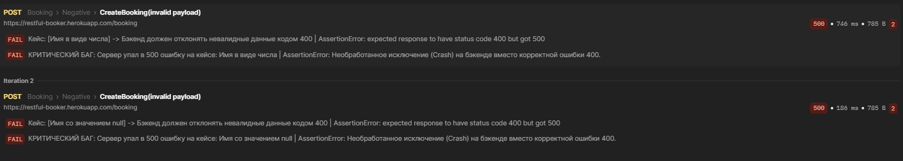

# Автоматизация тестирования API Restful-Booker

Проект содержит набор ручных и автоматических тестов для учебного API бронирования отелей Restful-Booker.


## Стек технологий
* **Тестирование API**: Postman (Collection Runner);
* **Автоматизация**: Python 3, Pytest, Requests;
* **CI/CD**: GitHub Actions (в процессе настройки).


## Структура проекта
```
├───postman
│   │   negative_tests.json
│   │   Restful_Booker_postman_collection.json
│   │
│   └───results
│           tests_report_1.json
│           tests_report_1_part_1.png
│           tests_report_1_part_2.png
│           tests_report_2_DDT.json
│           tests_report_2_DDT.png
│
└───tests
    │   conftest.py
    └───test_booking.py
```
**`postman/` — папка с артефактами тестирования в Postman:**
* `Restful_Booker_postman_collection.json` — экспортированная коллекция ручных тестов Postman с настроенными скриптами автоматической передачи токенов.
* `negative_tests.json` — файл данных для автоматизации полейного негативного тестирования.

**`postman/results/` - папка с результатами прогона тестов в Postman:**
* `tests_report_1.json` - сохраненный лог прогона CRUD-операций, фильтрации и негативных сценариев;
* `tests_report_1_part_1.png` - скриншот прогона CRUD-операций, фильтрации и негативных сценариев;
* `tests_report_1_part_2.png` - скриншот прогона CRUD-операций, фильтрации и негативных сценариев (вторая часть);
* `tests_report_2_DDT.json` - сохраненный лог прогона негативных DDT-сценариев ввода невалидных данных;
* `tests_report_2_DDT.png` - скриншот прогона негативных DDT-сценариев ввода невалидных данных.

**`tests/` - папка с автоматизацией тестирования на Python:**
* `tests/conftest.py` — конфигурация Pytest и фикстура автоматической авторизации (`auth_token`).
* `tests/test_booking.py` — позитивные автотесты сквозного сценария (CRUD) и негативные проверки безопасности на Python.


## Как запустить тесты локально:

### Тестирование в Postman
Проект реализует подход **DDT (Data-Driven Testing)** для полейного негативного тестирования. Вместо дублирования запросов, один эталонный эндпоинт автоматически параметризуется внешним файлом данных.

1. Импортируйте коллекцию `postman/Restful_Booker_postman_collection.json` в Postman;
2. Откройте **Collection Runner** для этой коллекции.
3. Уберите галочку с запроса `CreateBooking(invalid payload)` и нажмите кнопку <kbd>Start run</kbd>;
4. Чтобы запустить DDT-тесты: откройте **Collection Runner** для этой коллекции, уберите все галочки кроме `CreateBooking(invalid payload)`, в блоке **Test data file** выберите файл `postman/negative_tests.json` (режим `use locally`) и запустите прогон.

### Автотесты на Python (Pytest)
1. Установите зависимости: `pip install -r requirements.txt`
2. Запустите тесты: `pytest`


## Найденные дефекты
В ходе автоматизации API (как в сценариях Pytest/Python, так и тестировании в Postman) были обнаружены критические дефекты бизнес-логики и устойчивости архитектуры бэкенда.

### Дефект №1: Отсутствие логической валидации дат бронирования (`bookingdates`)
* **Суть бага:** Сервер успешно создаёт бронь (`200 OK`) в сценарии, когда дата выезда (`checkout`) идет ***раньше***, чем дата заезда (`checkin`). Например, при отправке `checkin: "2026-12-31"` и `checkout: "2026-01-01"`.
* **Влияние на бизнес:** Высокое. Критическая уязвимость логики отеля, которая в реальной системе приведет к порче календаря занятости номеров и невозможности корректного расчета стоимости проживания.
<details>
<summary>🔍 Нажмите, чтобы посмотреть скриншот отчета в Postman</summary>

")

</details>

### Дефект №2: Пропуск невалидных финансовых данных (`totalprice`)
* **Суть бага:** Бэкенд успешно принимает отрицательные числа в поле стоимости (`totalprice: -500`), создавая некорректную бронь со статусом `200 OK`.
* **Влияние на бизнес:** Критическое. Прямая уязвимость для финансовых потерь (отель становится «должен» клиенту за проживание).
<details>
<summary>🔍 Нажмите, чтобы посмотреть скриншот отчета в Postman</summary>

")

</details>

### Дефект №3: Приведение невалидной строки к `null` (Поле `totalprice`)
* **Суть бага:** При отправке строкового значения `"one hundred"` вместо ожидаемого целого числа (`Integer`), бэкенд не отклоняет запрос ошибкой клиента, а молча преобразует строку в `null` и сохраняет запись.
<details>
<summary>🔍 Нажмите, чтобы посмотреть скриншот отчета в Postman</summary>

")

</details>

### Дефект №4: Отсутствие строгой валидации Boolean-полей (`depositpaid`)
* **Суть бага:** Поле принимает некорректные строковые типы данных (например, `"yes"` вместо `true`/`false`), не возвращая ошибку контракта.
<details>
<summary>🔍 Нажмите, чтобы посмотреть скриншот отчета в Postman</summary>

")

</details>

### Дефект №5: Необработанное исключение при передаче невалидных типов в поля Имени/Фамилии
* **Суть бага:** При передаче в поля `firstname` или `lastname` типов данных `Integer` (`12345`) или `Null` вместо строки, сервер полностью падает с ошибкой `500` вместо возврата корректного ответа `400 Bad Request`.
* **Влияние:** Архитектурная уязвимость. Свидетельствует об отсутствии блоков `try-catch` на уровне контроллеров бэкенда, что снижает отказоустойчивость приложения.
<details>
<summary>🔍 Нажмите, чтобы посмотреть скриншот отчета в Postman</summary>



</details>

### Дефект №6: Отсутствие валидации некорректного формата дат (`bookingdates`)
* **Суть бага:** При отправке дат в неверном текстовом формате (например, `"not-a-date"` или `"tomorrow"` вместо строгого `YYYY-MM-DD`), бэкенд не возвращает ошибку клиента `400 Bad Request`, а создает бронь с искаженными данными.
<details>
<summary>🔍 Нажмите, чтобы посмотреть скриншот отчета в Postman</summary>

")

</details>

## О проекте
В качестве объекта тестирования используется популярный учебный сервис бронирования отелей **Restful-Booker**.

* **Сайт проекта / Тестовый стенд:** [**Restful-Booker**](https://restful-booker.herokuapp.com/)
* **API Документация:** [**Restful-Booker: API Docs**](https://restful-booker.herokuapp.com/apidoc/index.html)
* **Код:** [**Restful-Booker: Github**](https://github.com/mwinteringham/restful-booker)