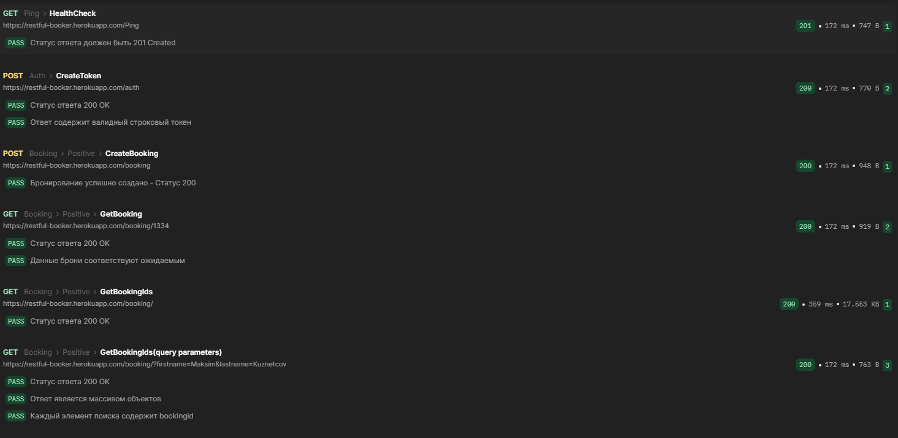
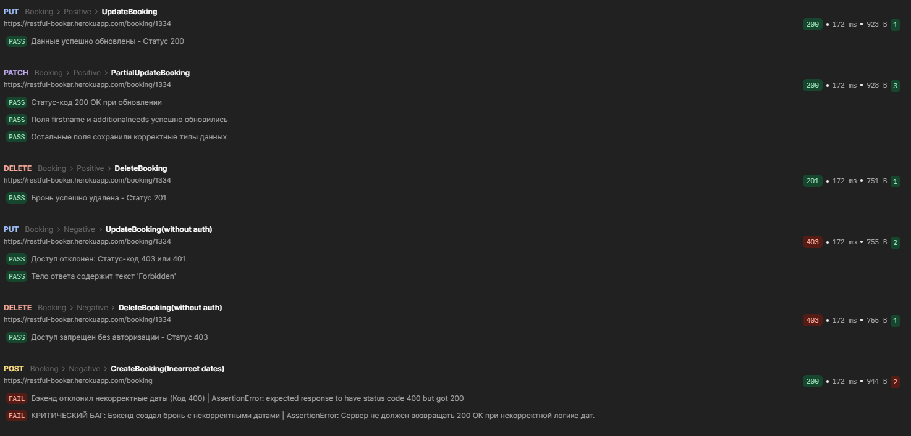
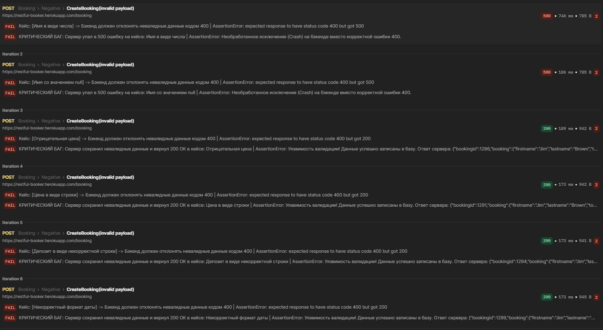

# Автоматизация тестирования API проекта Restful-Booker
Проект содержит комплексный фреймворк для функционального, негативного, контрактного и Data-Driven тестирования API учебного проекта Restful-Booker.


## ⚙️ Стек технологий
* **Тестирование API**: Postman (Collection Runner)
* **Автоматизация**: Python 3, Pytest, Requests
* **CI/CD**: GitHub Actions (Автозапуск тестов), Allure Report (Интерактивные отчеты)


## 📂 Структура проекта
```
├───postman
│   │   negative_tests.json
│   │   Restful_Booker_postman_collection.json
│   │
│   └───results
│           tests_report_1.json
│           tests_report_1_part_1.png
│           tests_report_1_part_2.png
│           tests_report_2_DDT.json
│           tests_report_2_DDT.png
│
└───tests
    │   conftest.py
    └───test_booking.py
```

**`postman/` — папка с артефактами тестирования в Postman:**
* `Restful_Booker_postman_collection.json` — экспортированная коллекция ручных тестов Postman с настроенными скриптами автоматической передачи токенов.
* `negative_tests.json` — файл данных для автоматизации полейного негативного тестирования.

**`postman/results/` - папка с результатами прогона тестов в Postman:**
* `tests_report_1.json` - сохраненный лог (JSON) прогона CRUD-операций, фильтрации и базовых негативных сценариев;
* `tests_report_1_part_1.png` - скриншот отчета прогона CRUD-операций и фильтрации (часть 1);
* `tests_report_1_part_2.png` - скриншот отчета прогона базовых негативных сценариев безопасности (часть 2);
* `tests_report_2_DDT.json` - сохраненный лог (JSON) прогона негативных DDT-сценариев валидации полей;
* `tests_report_2_DDT.png` - скриншот отчета прогона DDT-сценариев, наглядно зафиксировавшего критические дефекты бэкенда.

**`tests/` — папка с автоматизацией тестирования на Python (Pytest):**
* `conftest.py` — конфигурация Pytest, глобальная база фикстур, фикстура авторизации (`auth_token`) и эталонный шаблон данных (`valid_booking_payload`).
* `test_booking.py` — монолитный тестовый класс, содержащий сквозной E2E-сценарий (Health Check -> CRUD -> Фильтрация) со строгим порядком выполнения, негативными тестами, а также параметризованный тест-ловушку для полейного DDT.

>**Весь код полностью интегрирован с Allure Framework**: размечен на логические шаги (`allure.step`), структурирован по фичам (`allure.feature/story`) и автоматически прикрепляет форматированные JSON-логи запросов и ответов (`allure.attach`) для детального дебага.


## Как запустить тесты локально:

### 🚀 Запуск в Postman
1. Импортируйте коллекцию `postman/Restful_Booker_postman_collection.json` в Postman;
2. Откройте **Collection Runner** для этой коллекции.
3. Уберите галочку с запроса `CreateBooking(invalid payload)` и нажмите кнопку <kbd>Start run</kbd>;
4. Чтобы запустить DDT-тест: откройте **Collection Runner** для этой коллекции, уберите все галочки кроме `CreateBooking(invalid payload)`, в блоке **Test data file** выберите файл `postman/negative_tests.json` (режим `use locally`) и запустите прогон.

>Проект реализует подход **DDT (Data-Driven Testing)** для полейного негативного тестирования. Вместо дублирования запросов, один эталонный эндпоинт автоматически параметризуется внешним файлом данных.

### 🐍 Автотесты на Python (Pytest)

1. **Создайте и активируйте виртуальное окружение**:
    * **Для Windows**:
    ```
    python -m venv venv
    venv\Scripts\activate
    ```
    * **Для macOS / Linux**:
    ```
    python3 -m venv venv
    source venv/bin/activate
    ```
2. **Установите зависимости**:
    ```
    pip install -r requirements/requirements.txt
    ```
3. **Запустите тесты**:
    ```
    pytest -v
    ```

>Рекомендуется запускать тесты в изолированном виртуальном окружении.


## 📊 Живой отчет о тестировании (Allure Report)
Результаты автоматического запуска тестов на Python в облаке GitHub Actions доступны по ссылке:
👉 [**Смотреть Allure Report проекта**](https://maksimkuznetcov.github.io/restful_booker_api_pytest/)


## 📊 Скриншоты отчета прогонов в Postman

* **`tests_report_1_part_1.png`**
    <details>
    <summary>🔍 Нажмите, чтобы посмотреть</summary>

    

    </details><br>

* **`tests_report_1_part_2.png`**
    <details>
    <summary>🔍 Нажмите, чтобы посмотреть</summary>

    

    </details><br>

* **`tests_report_2_DDT.png`**
    <details>
    <summary>🔍 Нажмите, чтобы посмотреть</summary>

    

    </details><br>


## Выявленные дефекты
В ходе автоматизации API (как в сценариях Pytest/Python, так и тестировании в Postman) были обнаружены критические дефекты бизнес-логики и устойчивости архитектуры бэкенда.

### Дефект №1: Отсутствие логической валидации дат бронирования (`bookingdates`)
* **Суть бага:** Сервер успешно создаёт бронь (`200 OK`) в сценарии, когда дата выезда (`checkout`) идет ***раньше***, чем дата заезда (`checkin`). Например, при отправке `checkin: "2026-12-31"` и `checkout: "2026-01-01"`.
* **Влияние на бизнес:** Высокое. Критическая уязвимость логики отеля, которая в реальной системе приведет к порче календаря занятости номеров и невозможности корректного расчета стоимости проживания.

### Дефект №2: Пропуск невалидных финансовых данных (`totalprice`)
* **Суть бага:** Бэкенд успешно принимает отрицательные числа в поле стоимости (`totalprice: -500`), создавая некорректную бронь со статусом `200 OK`.
* **Влияние на бизнес:** Критическое. Прямая уязвимость для финансовых потерь (отель становится «должен» клиенту за проживание).

### Дефект №3: Приведение невалидной строки к `null` (Поле `totalprice`)
* **Суть бага:** При отправке строкового значения `"one hundred"` вместо ожидаемого целого числа (`Integer`), бэкенд не отклоняет запрос ошибкой клиента, а молча преобразует строку в `null` и сохраняет запись.

### Дефект №4: Отсутствие строгой валидации Boolean-полей (`depositpaid`)
* **Суть бага:** Поле принимает некорректные строковые типы данных (например, `"yes"` вместо `true`/`false`), не возвращая ошибку контракта.

### Дефект №5: Необработанное исключение при передаче невалидных типов в поля Имени/Фамилии
* **Суть бага:** При передаче в поля `firstname` или `lastname` типов данных `Integer` (`12345`) или `Null` вместо строки, сервер полностью падает с ошибкой `500` вместо возврата корректного ответа `400 Bad Request`.
* **Влияние:** Архитектурная уязвимость. Свидетельствует об отсутствии блоков `try-catch` на уровне контроллеров бэкенда, что снижает отказоустойчивость приложения.

### Дефект №6: Отсутствие валидации некорректного формата дат (`bookingdates`)
* **Суть бага:** При отправке дат в неверном текстовом формате (например, `"not-a-date"` или `"tomorrow"` вместо строгого `YYYY-MM-DD`), бэкенд не возвращает ошибку клиента `400 Bad Request`, а создает бронь с искаженными данными.

## О проекте
В качестве объекта тестирования используется популярный учебный проект **Restful-Booker**.

* **Сайт проекта / Тестовый стенд:** [**Restful-Booker**](https://restful-booker.herokuapp.com/)
* **API Документация:** [**Restful-Booker: API Docs**](https://restful-booker.herokuapp.com/apidoc/index.html)
* **Код:** [**Restful-Booker: Github**](https://github.com/mwinteringham/restful-booker)